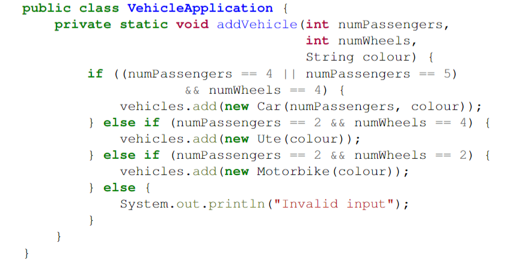
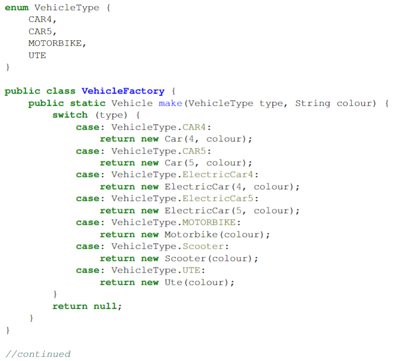

# SOFT2201 -- Week 4 Tutorial

## Q1: Issues with Constructors

**Readablitiy**
- Quite poor.
- If more types of objects are added, more if-else blocks need to be added to accomodate these additions (making reading difficult).
- No comments are used to explain code for other developers.
- The program also has magi numbers, which are numbers that are used repeatedly (can be made a static variable instead).

**Maintainability**
- Quite poor.
- Suppose there is a bug in one of the if-else blocks. Each one of those blocks must be manually scanned to find the bugs, which is quite time consuming and tiresome.
- As mentioned earlier, to add a new type, a new if-else block must be added always.
- This clearly violates the *Open-and-Close* principle

**Dependencies**
- Dependency Inversion Principle is violated.
&rarr; The class *VehicleApplication* is using concrete classes like Car, Ute, etc. Suppose the implementation for car class needs to be changed, then `VehicleApplication.addVehicle()` must alos be adjusted.

**Reusability**
- The logic of the code is hard coded. For example, to add a new type like Sportscar with 2 passenger seats, the if conditions must be modified.
-

 

## Q2: Is this better? (hint: kinda)
